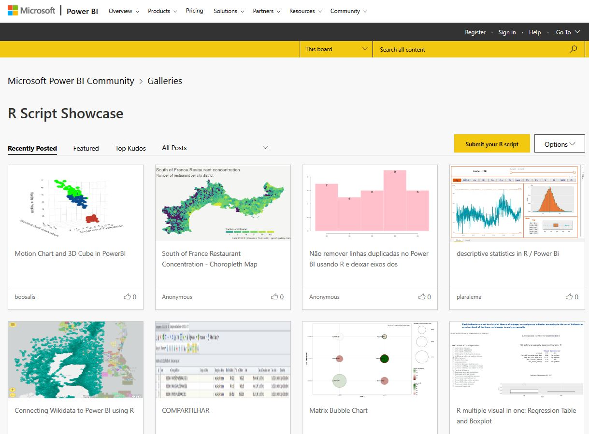
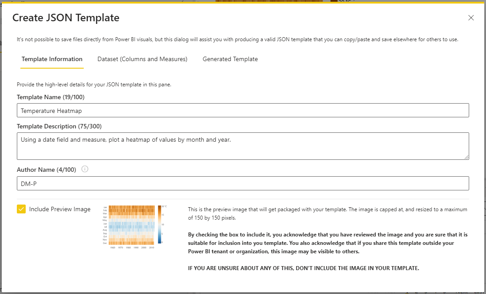

# Thoughts about creating a template repository
The current repository is a good thing, but I think it would help to add:
1. An image showing the chart
2. A link to download a working .pbix file
3. The author and a brief description of the functionality
4. The code in a scrollable window

## Example
- **100% Stacked Area with interactive hover**
<kbd>

</kbd>

  [Download **100% Stacked Area.pbix**](./Deneb%20templates.pbix)

  Author: [Kerry Kolosko](https://kerrykolosko.com/portfolio/100-stacked-area/)

  100% stacked area chart. When you hover over a bar, it highlights on chart and legend with a tooltip.
 
  https://github.com/somedaygone/Deneb-Templates/blob/2b9b06854f89577312eedb5b8d8f3f0bc1492e5b/templates/100%25%20Stacked%20Area.json#L1-L150

## Alternative repository ideas
Having a working copy of the template on GitHub or a webpage would be nice so that the charts could be interactive. It would be harder to maintain the repository if we have to make the code work in Deneb and a separate copy on GitHub or a webpage. I think Power BI users are going to be fine with a static image and an easy .pbix download link from GitHub.

A great alternative would be for Microsoft to create a Deneb Gallery, like the [R Script Showcase](https://community.powerbi.com/t5/R-Script-Showcase/bd-p/RVisuals) gallery. 

Curation could be a little bit of a challenge, but the R gallery looks cleaner than I expected. If someone other than Microsoft wanted to sponsor a Power BI workspace, I think that also would be a great template repository and better than GitHub.

## Template standards
Templates are different than Examples. Examples show off coding techniques. Templates should be plug-and-play usable with other data.
- Templates should have a working .pbix file
  - .pbix should have sample data imported from [Vega datasets](https://github.com/vega/vega-datasets) or this repository
  - no static data (else it's probably an example file and not a template)
  - can also have the original data/chart that inspired the template, but smaller file size and reusable formatting is preferred
- Specs should be clean (else it's an example and not a template!)
  - Remove domain specific data and labels
  - Try to limit `config` to necessary elements
  - Ideally should have no log errors or warnings
  - Every `mark` should have a `description`
- Regenerate template from the working .pbix file with current Deneb version
  - All template fields should be filled in and a sample image included
  
  - Include link to the author's blog post or video if available
- Create a sample .jpg image for GitHub with any important hover/click interactions
  - Standard size (360x200?)
  <kbd>

</kbd>

## Further thoughts
I've gone through 3 or 4 templates on [PowerBI-tips/Deneb-Templates](https://github.com/PowerBI-tips/Deneb-Templates) and have come to the conclusion that there is too much work to be done to standardize what's already out there without engaging the original authors.

The biggest challenge is finding suitable data. It takes a while to find data that works with the template, and unless I'm doing something wrong, I struggle to get Deneb to remap fields. Another sizable challenge is to truly make the Vega code a template and not fit too tightly to the original dataset. Titles and labels and offsets tend to be fit to the original chart and haven't been removed from the templates. Also a lot of the templates are from earlier versions of Deneb and Vega-lite and already need to be tweaked to work.

In short, the amount of work to be done would change the code enough that the work is no longer the author's template.

## Next steps
I think a proper template directory should have the [standards above](./thoughts.md#template-standards), and at a minimum it would require the template authors to at least provide a working .pbix file, if not meeting all the standards. If all the authors are [here](https://github.com/PowerBI-tips/Deneb-Templates/tree/main/authors), maybe that's achievable with just a handful of authors.

A more feasible compromise may be to just add images and descriptions where available, and the code. It would make browsing through the repository easier if a critical mass have images.

## Example
- **100% Stacked Area with interactive hover**
<kbd>

</kbd>

  Author: [Kerry Kolosko](https://kerrykolosko.com/portfolio/100-stacked-area/)

  100% stacked area chart. When you hover over a bar, it highlights on chart and legend with a tooltip.

  https://github.com/somedaygone/Deneb-Templates/blob/2b9b06854f89577312eedb5b8d8f3f0bc1492e5b/templates/100%25%20Stacked%20Area.json#L1-L150

The negatives here are that there's no working copy, and the templates aren't always that easy to get working with your own data. Isn't that the point of the repository? In contrast, the Vega-lite Examples are very easy to implement in Deneb because they provide a working version with public data and rarely over-customize the visual. We could do that with Deneb templates, but we will have to curate the templates.
